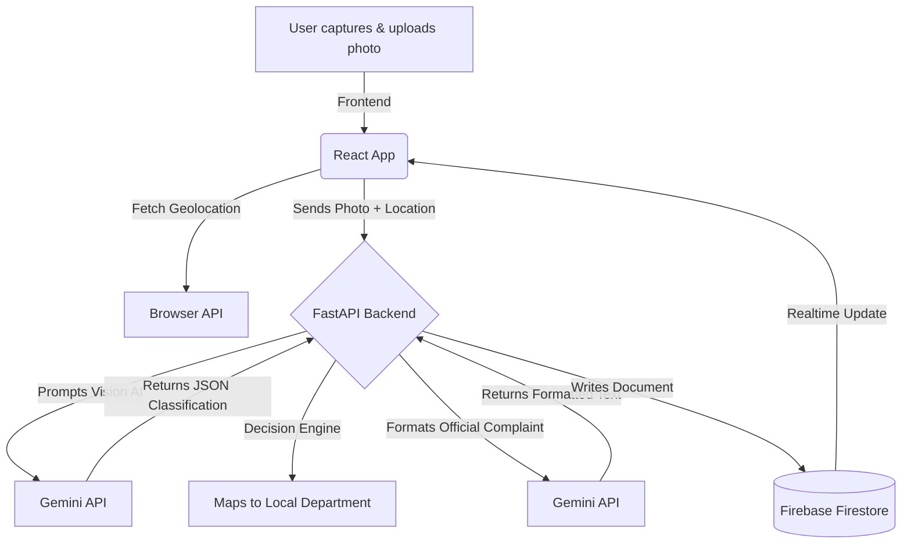

# FixMyCity AI

## 1. Problem
Citizens frequently discover civic issues like potholes, open garbage, broken streetlights, or water leaks, but the process of reporting them to the correct local authority is complicated, disconnected, and frustrating. Without an easy way to verify the issue and track its status, many go unreported.

## 2. Solution
**FixMyCity AI** is an AI-powered assistant that converts images of civic issues into structured formal complaints. Using Google's Gemini Vision API and the Geolocation/Google Maps API, users simply snap a photo and click submit, and the app automatically identifies the problem, maps it to the correct department, and tracks real-time status updates through Firebase.

## 3. Features
- **Image classification (Gemini):** Automatically identifies the severity and type of civic issue from a single image.
- **Auto complaint generation:** Converts the image data and location into a professional summary for civic authorities.
- **Department mapping:** An intelligent decision engine routing specific problems to their respective authorities (e.g. Sanitation, Electricity, Water).
- **Real-time tracking:** Simple, readable status tags mapping the lifecycle of from `pending` -> `in_progress` -> `resolved`.

## 4. Tech Stack
- Frontend: React + Vite + Custom CSS
- Backend: Python FastAPI
- AI: Google GenAI (Gemini) API
- Database: Firebase Admin SDK
- Extra: Browser Geolocation

## 5. Flow Diagram

